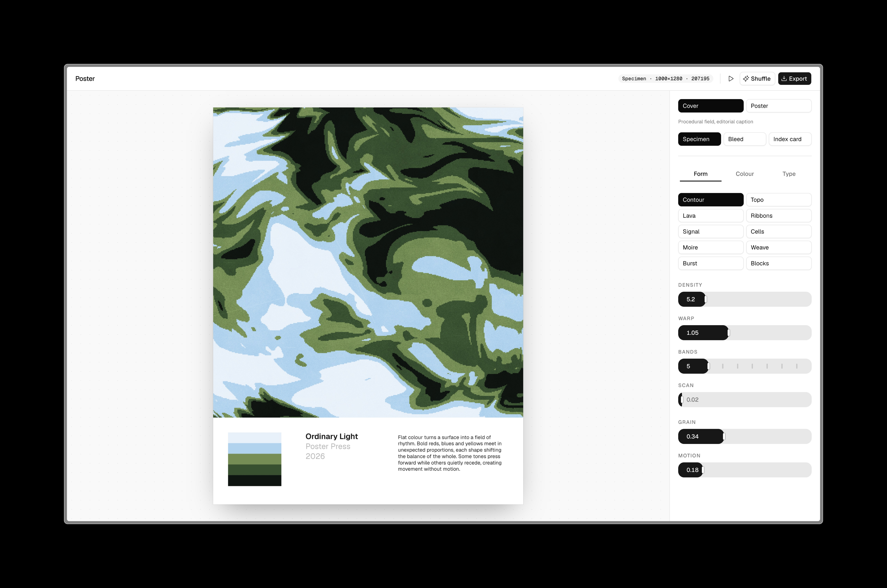

# Poster

Poster generates printable poster art in your browser. Pick a colour palette, or upload an image and Poster takes the colours out of it. Choose a layout, type in your own text, and it draws the artwork. Shuffle until you get one you like, then export as PNG.

## Run it

```bash
pnpm install
pnpm dev
```

Then open [localhost:3000](http://localhost:3000).
